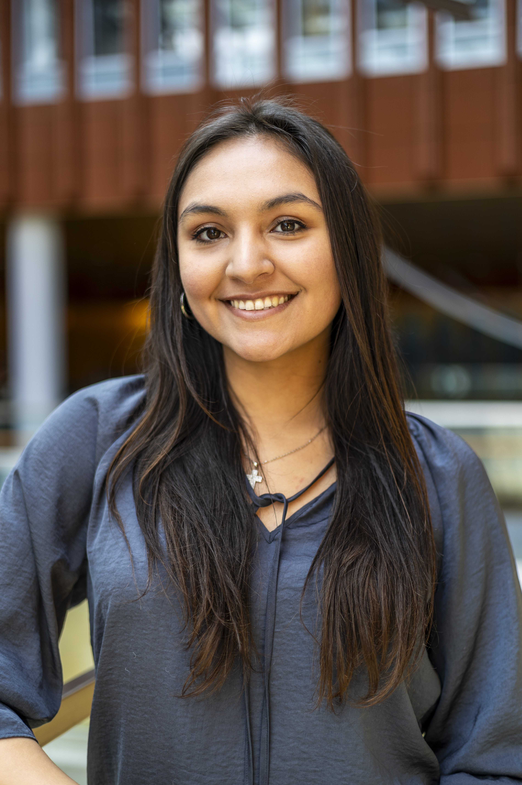

# Sofia Valbuena

<h3>About Me 💁‍♀️</h3>

I am a Computer Science and Economics double major at the University of Michigan and a Software Engineering Intern at Enova International. My primary passions are coding and macroeconomics; I am pursuing a career in fintech. I am a University of Michigan Synchronized Skating Team student-athlete and a two-time Midwestern and Pacific Coast Synchro Sectional medalist.

  <a href="sofiavalb03@gmail.com" Email/a>

### Technical Skills :desktop_computer: 
- C/C++
- Python
  - Flask
- JavaScript
  - React
- Go
- HTML
- CSS
- SQL
- Excel
- R
- STATA

### Recent Projects 🔧
- Application Stage Synchronization for Enova International
- Google Clone
- MapReduce
- Instagram Clone
  - Client-side Dynamic Pages
  - Server-side Dynamic Pages
  - Templated Static Site Generator
- Data & Memory Cache Simulator
- SQL Command Line Interface
- Machine Learning Forum Organizer
- Computer Vision

### Software 👨‍💻
- AWS
  - EC2, Lambda, EventBridge, SQS
- Terraform
- Excel
